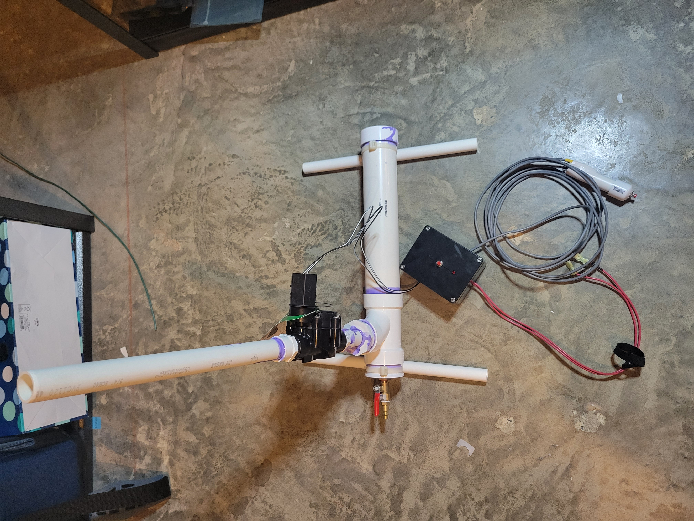
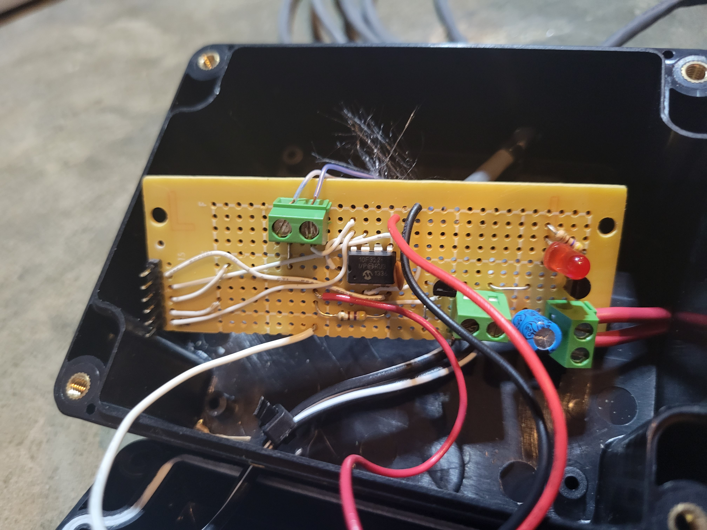

# Compressed Air Rocket Launcher

This launcher is designed to launch paper rockets using compressed air and PVC. The idea is that you pressurize the reservoir to roughly 45psi using an air compressor, or bike pump. You then place the rocket on the pipe, and energize the sprinkler valve causing the rocket to fly roughly 150ft into the air. The additional items added were to make it more user friendly.

## Making The Launcher
This process was difficult in that it was hard to find all the correct adapters. My constraints were:

- 1" Sprinkler Valve
- Air Compressor Connection
- A reservoir that was larger than 1"
- Beside cutting down to length, no other modifications of the PVC were required (important for structural integrity)

Sitting at Lowes I began with the sprinkler valve. I then started piecing things together until I came up with what was in the picture. I found different store locations had different adapters in stock so you really just work with what you have available.

# Launch System

The purpose of the launch system is to protect the sprinkler valve solenoid, and provide some safety. The solenoid is designed to be powered from 24VAC. To make the setup easier I wanted to run it from a 12VDC battery. The solenoid, being and AC solenoid, has both resistance and reactance. Supplying DC significantly reduces the impedance provided by the reactance, therefore if powered for too long could burn up the solenoid. To eliminate the possibility fo this happening I designed the launch system.

The launch system controls the launch sequence by forcing the user to press the arm button (red button on the box), then step back some distance and press the launch button (red button on the PVC). The code with then bias the FET for ~500ms and turn off and require the user to go through the launch sequence again. This process protects the solenoid.

As you can se in the picture it was just something I prototyped together. At the hard of it is a PIC microcontroller that runs the state machine. There is also a voltage regulator to step 12V down to the 5V required by the PIC. 